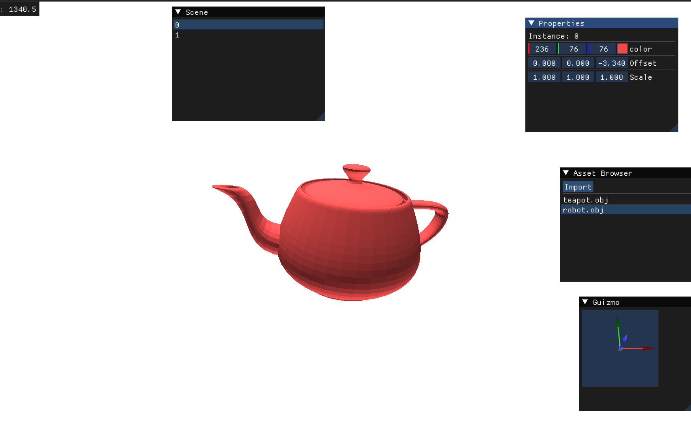
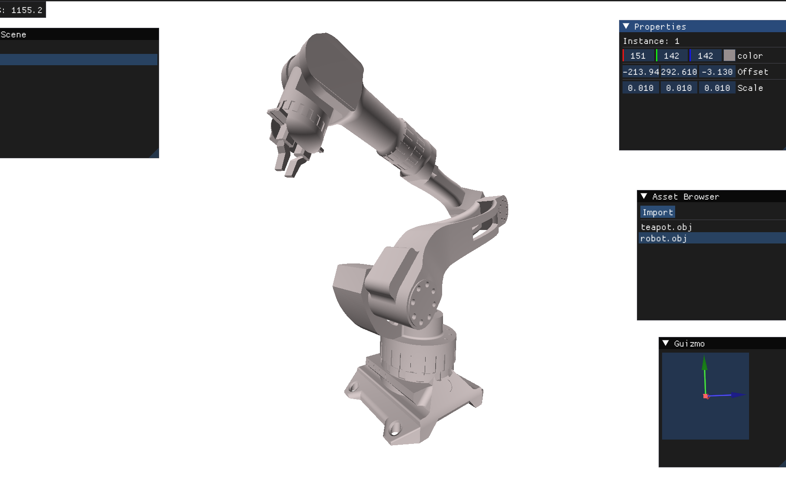

# Rendr

A C++ lightweight library for low-overhead rendering. The focus is explicit GPU memory handling, batched draws, and streaming-friendly updates — not ray tracing or a full graphics engine.

CPU writes go directly into persistently mapped buffers. Meshes share a single vertex/index arena, instance data lives in SSBOs, and the frame is submitted with one `glMultiDrawElementsIndirect` call. Windowing and context setup stay on the applicationside; the bundled editor is just for demo purposes.

Note: Vulkan rewrite is in progress since this project feels like a fight against the OpenGL api at this point.

---

## Model Loading

  

---

## Dynamic Data Streaming (color and offset attributes)

[▶ Watch Procedural Animation](docs/animation.gif)

**Note:** The animation is fully procedural and computed on the CPU each frame. On my machine, the current performance bottleneck is the animation update loop, not the rendering pipeline itself.

The scene consists of **100k instanced quads**, each made of **4 vertices**.

Point sprites are more memory-efficient for particle systems (1 vertex per particle instead of 4). However, in this case they would not improve performance due to the CPU bottleneck mentioned above, and they are not the focus of this demo anyways.
